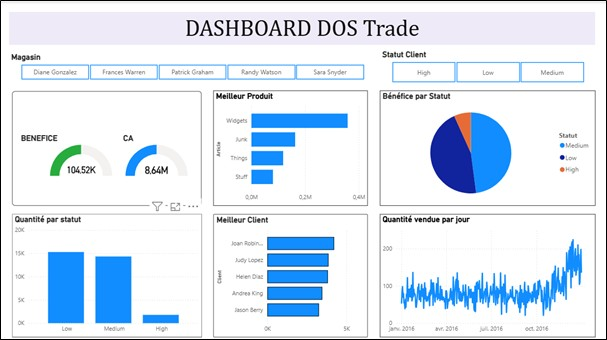

# Business-Intelligence
I-  
Introduction 
Ce rapport présente mon projet d'entreprise visant à exploiter les données fournies pour 
améliorer les opérations et les performances globales de mon entreprise. Les données 
disponibles comprennent les colonnes suivantes : Magasin, Ville, Région, Client, Date 
de commande, Article, Quantité, Prix, Chiffre d'affaires, Bénéfice. La base de mon 
travail est une baes mise à disposition par un youtubeur pour faire tu tableau de bord.   
Ce travail a été réalisé avec le logiciel Power BI. 
DOS TRADE 
DOS Trade, une PME comptant 10 employés et 525 clients répartis dans 5 magasins, 
opère dans le secteur du commerce de détail. L'entreprise vise à améliorer la rentabilité 
et la croissance de l'entreprise en optimisant l'efficacité opérationnelle, en renforçant la 
fidélisation client. Chaque transaction commerciale représente une instance du 
processus, soulignant l'importance de l'analyse des données empiriques. Nous disposons 
d’un département analytique qui a à son niveau un data analyste qui analyse les données 
des commandes de manière efficace.  
Le modèle commercial repose sur la vente au détail de produits dans plusieurs magasins 
répartis dans différentes régions. L'entreprise vise à maximiser le chiffre d'affaires et les 
bénéfices en répondant aux besoins des clients et en optimisant les opérations. 
Scénario BI envisagé est le scénario 1. BI séparée du management stratégique, mais 
les résultats de l’analyse peuvent être utilisés pour mettre au point de nouvelle stratégie 
de la gestion des ventes dans chaque magasin. La Business Intelligence joue un rôle 
central en fournissant des analyses approfondies et en temps réel des données 
opérationnelles. Grâce à la BI, l'entreprise peut surveiller les performances des 
magasins, identifier les tendances du marché, optimiser les processus métier, et 
personnaliser l'expérience client. Les rapports et tableaux de bord générés par la BI 
guident les décideurs dans leurs choix stratégiques, en les aidant à prendre des décisions 
éclairées pour stimuler la croissance et la rentabilité de l'entreprise. 
Analyse des performances et prise de décision : Ce processus consiste à collecter, 
consolider et analyser les données relatives aux ventes, aux marges bénéficiaires, et aux 
KPIs. Les rapports générés permettent aux décideurs de suivre les performances des 
magasins, d'identifier les tendances et les opportunités, et de prendre des décisions 
stratégiques éclairées pour optimiser les opérations et maximiser la rentabilité. 
Gestion de la relation client et marketing : Ce processus vise à collecter des données 
sur les clients, à les analyser pour segmenter la clientèle et à développer des stratégies 
marketing ciblées. Il inclut également la mise en œuvre de programmes de fidélisation, 
la gestion des retours et réclamations, ainsi que la communication avec les clients via 
différents canaux (physique, digital, réseaux sociaux) pour renforcer la relation client et 
favoriser la rétention. 
En termes de Perspective, on considère les trois possibles mais pour les informations 
actuelles on met l’accent sur la perspective production. Le responsable du processus 
est l’entreprise en rapport avec le département marketing et financier, les sujets du 
processus sont les clients des magasins et les acteurs sont le personnel de l’entreprise.  
En termes de vue, on envisage la vue par événement et transversale.  
L’objectif analytique est d’analyser la performance des magasins, produit et faire une 
segmentation de la clientèle. Il s’agit de l’objectif descriptif. 
Les KPI considérés sont les suivants : 
• Chiffre d'affaires par magasin, 
• Bénéfice par magasin, 
• Statut client 
• Achat des différents produits. 
Pour ces KPIs plusieurs facteurs influents sont à considérer tels que l'emplacement du 
magasin, les événements saisonniers, la concurrence locale, les coûts d'exploitation, les 
tendances de consommation, les prix et promotions. Comprendre ces facteurs va nous 
permettre de mieux appréhender les dynamiques du marché et de prendre des décisions 
stratégiques plus éclairées pour optimiser nos performances et maximiser la rentabilité. 
Evaluation des données : Nous avons défini les statuts des clients sur la base du chiffre 
d’affaires. Les montants sont en euro. 
High: CA>2830 
Medium: 1415<=CA<=2830 
Low: CA<1415  
Source de données : https://bit.ly/2TMIEto  ( veuillez copier et coller le lien dans la barre 
d'adresse de votre navigateur, puis cliquez sur ENTER.) 
Lien du tableau de bord Porwer BI : 
https://app.powerbi.com/links/iIrYCVSOOw?ctid=2fbd12a9-cbb9-49a2-9612
7af4096a6529&pbi_source=linkShare

Voici un aperçu du tableau de bord :

